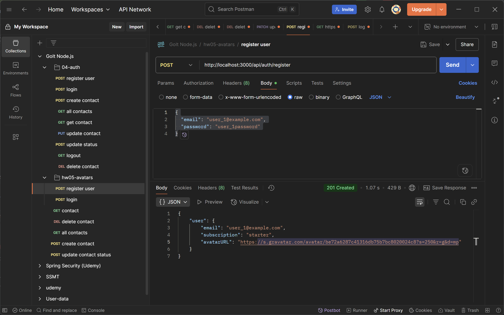

## Робота з файлами та тестування додатків
 Додай можливість завантаження аватарки користувача через [Multer].

### Крок 1

Створи папку public для роздачі статики. У цій папці зроби папку avatars.
Налаштуй Express на роздачу статичних файлів з папки public.
Поклади будь-яке зображення в папку public/avatars і перевір, що роздача статики працює.
При переході по такому URL браузер відобразить зображення. Shell http://locahost:<порт>/avatars/<ім'я файлу з розширенням>

### Крок 2

У схему користувача додай нову властивість avatarURL для зберігання зображення.
```
{
...
avatarURL: DataTypes.STRING,
...
}
```

Використовуй пакет gravatar для того, щоб при реєстрації нового користувача відразу згенерувати йому аватар по його email.

### Крок 3

При реєстрації користувача:

Створюй посилання на аватарку користувача за допомогою gravatar
Отриманий URL збережи в поле avatarURL під час створення користувача

### Крок 4

Додай можливість поновлення аватарки, створивши ендпоінт /auth/avatars і використовуючи метод PATCH.

### Запит
````
PATCH /auth/avatars
Content-Type: multipart/form-data
Authorization: "Bearer {{token}}"
RequestBody: завантажений файл
````

### Успішна відповідь
````
Status: 200 OK
Content-Type: application/json
ResponseBody: {
"avatarURL": "тут буде посилання на зображення"
}
````

### Неуспішна відповідь
```
Status: 401 Unauthorized
Content-Type: application/json
ResponseBody: {
"message": "Not authorized"
}
```

Створи папку temp в корені проекту і зберігай в неї завантажену аватарку.
Перенеси аватарку користувача з папки temp в папку public/avatars і дай їй унікальне ім'я для конкретного користувача.
Отриманий URL /avatars/<ім'я файлу з розширенням> та збережи в поле avatarURL користувача

## Результати виконання роботи

